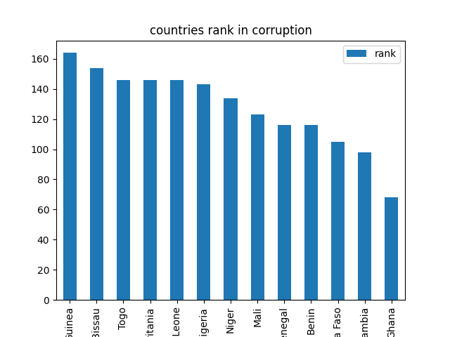
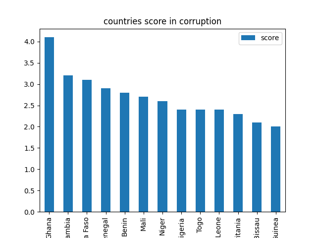
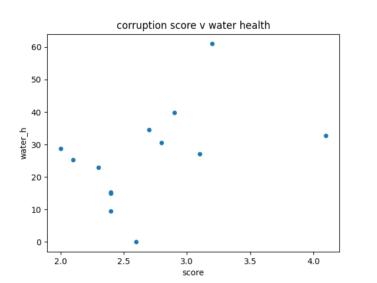
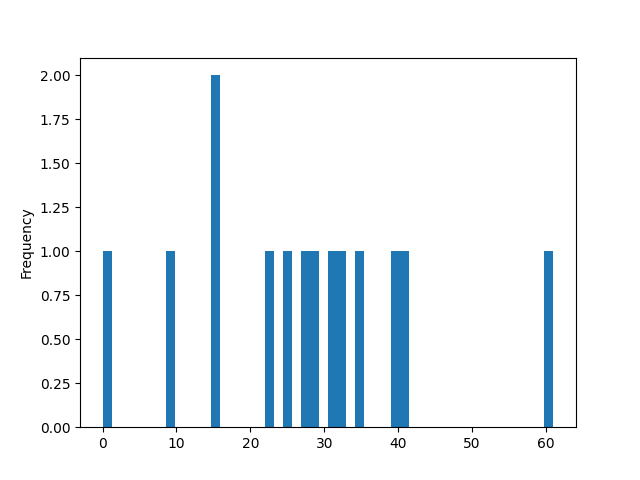

# Environment-Corruption 

# Summary
Created a pipeline that analyses the Environmental Performance Index (EPI) and the Corruption Index (CI) of nations in the subregion of Western Africa. To start I used sqlalchemy, created an engine to connect to postgresql and psycopg2 and to the epi database. After, I querried the database in order to be able to request the data from the epi_country table, then created a pandas DataFrame to save the epi_country table. Furthermore, I filtered epi data to get data for the geographical subregion of Western Africa. For the corruption index, read the csv file into pandas dataframe, then drop null values however, there were no null values which is good for our analysis. Using the CI dataframe, create a table in SQL using df.to_sql method. Now that I have both the EPI and CI dataframe I did a left join on country. Lastly, create visualizations to show relationship between the columns in the epi and ci tables. 

# Result 

This visualization display the relationship between nations in Western Africa and their corruption rank. Most of the countries in West Africa rank in top most corrupt nations around the world as the highest corrupted rank country is at 178.

This visualization display the relationship between nations in Western Africa and their corruption score. If we comapre these nation corruption score and their rank we can see that Guinea have a lower score and a high rank in corruption which make sense because the higher the score the less corrupt. Also compare to all other nations the West African nations have very low score meaning there is lot of corruption in these nation, because the highest corruption score is 9.3. 

In this graph the realtionshp between corruption score and water health shows that there is no much a correlation between the two, because corruption scores of 4.0 have water health of 30-32. However, some of the lower corruption scores show lower water health. 

In this graph the realtionshp between corruption rank and air health shows that the more corrput the nation the lower the air health, and the lower the corruption rank the higher the air health.

# Next Action
The next action I can take is to look into the relationship between corruption and life expentancy, or a country democracy, aslo corruption and the country annual income or economic development. 

